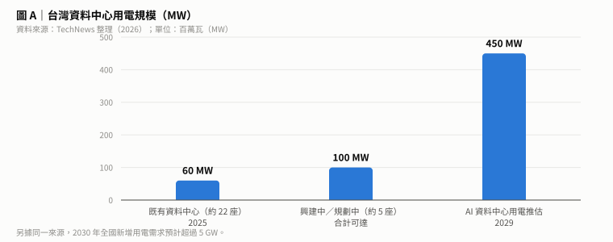
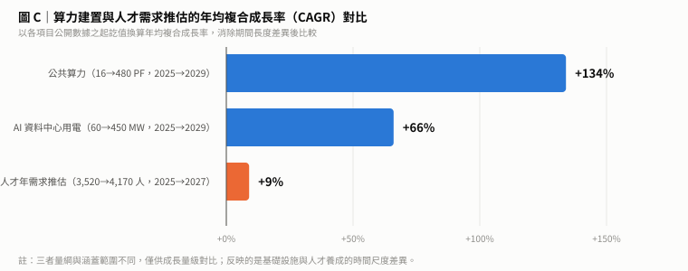
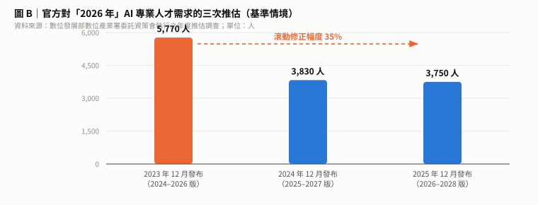
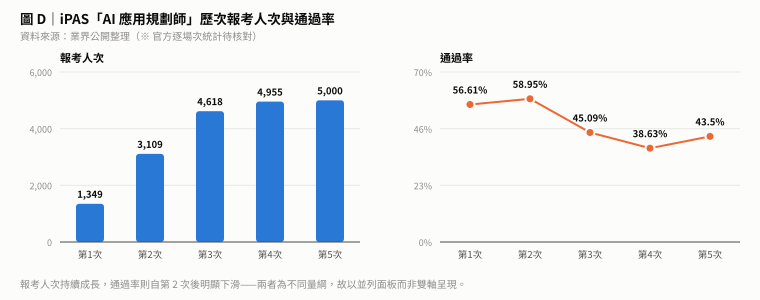
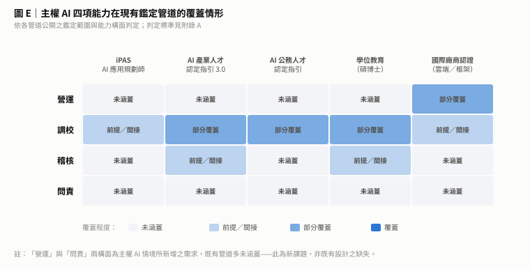
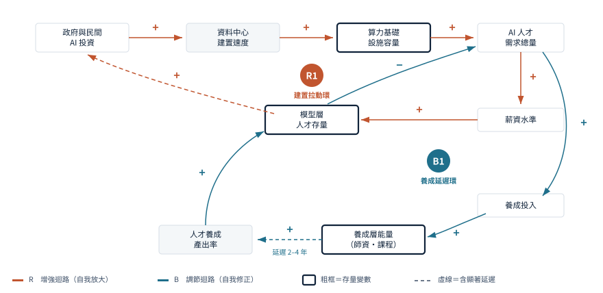
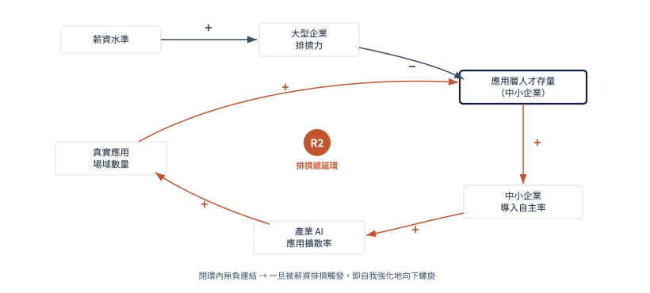
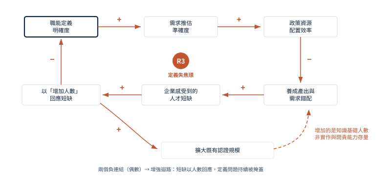

## 摘要

2026 年，全球主權 AI（Sovereign AI）的競賽正式進入白熱化。法國宣布 1,090 億歐元的 AI 投資方案、沙烏地阿拉伯與 NVIDIA 簽下 20 萬顆 GPU 的合作、印度 IndiaAI 推出約 12 億美元的國家計畫、英國成立 7.82 億英鎊的主權 AI 基金。台灣也在同一年成立國家人工智慧戰略特別委員會，將主權 AI 正式列為國家核心戰略。

但若仔細檢視這些國家計畫的細節，會發現一個共同現象：**錢幾乎都砸在算力，人才的部分多半只有簽證政策。** 換句話說，各國解決人才問題的主要手段是「進口」，而不是「養成」。

問題是，人才恰恰是主權 AI 四根支柱中，唯一無法用資本在短期內取得的一根。晶片可以採購、機房可以興建、模型可以微調，但能夠營運、調校、稽核、問責這套系統的人，買不到也急不來。

回到台灣。本研究比較數位發展部委託資策會執行的三個年度版本人才需求推估，其對 2026 年的基準值分別為 5,770 人、3,830 人與 3,750 人——在 AI 應用明顯加速的同一期間，推估需求呈現逐年下降的走向，此一現象可能尚有進一步確認的空間。更值得注意的是涵蓋範圍——該調查設計上以資訊服務業與 AI 新創為對象，未涵蓋製造、金融、醫療、零售等應用端，而那正是主權 AI 人才需求的主體所在。供給側亦然：iPAS「AI 應用規劃師」兩年累計近兩萬人次報考，就其設計目的而言相當成功，但它從設計上就不是主權 AI 人才的鑑定工具。

台灣其實已有職能框架——《AI 產業人才認定指引 3.0》（2026 年 5 月行政院通過）定義應用、開發、研究三類與五項核心能力，《AI 公務人才認定指引》Beta 版（2026 年 6 月）則規劃三類人才、8 大模組、40 門課程。但把這兩份指引與主權 AI 所需的四項能力對照，會發現三個空缺：**能力構面上未涵蓋營運與問責、鑑定層級止於知識與工具操作、而公務人才認定首波採認的 25 張證照以 AWS／Google／Microsoft 為主——鑑定權實際上在外商。**

值得注意的是，需求其實已經在法規層次浮現。金管會《金融業運用人工智慧（AI）指引》（2024.06）已明文要求由**具備 AI 專業之人員**建立獨立審查機制，並要求人員對外部生成式 AI 的產出進行客觀且專業的風險控管——但該指引並未定義「AI 專業」的內涵，亦未指明可據以判定的鑑定管道。衛福部、食藥署、行政院亦已發布領域別 AI 指引。**這些高度監管領域，既是需求最明確之處，也應是主權 AI 人才體系最先導入的場域。**

算力與人力的落差同樣具體。台灣現有 36 座資料中心、既有負載約 60MW，AI 資料中心用電推估將於 2029 年達 450MW；公共算力則規劃自 16PF 推升至 480PF。換算為年均複合成長率，公共算力約 **+134%**、資料中心用電約 **+66%**，而官方 AI 專業人才年需求推估僅約 **+9%**——**不到公共算力成長率的十五分之一**。而在人力面，公開資訊所能觀察到的規模相當有限：作為台灣主權模型代表計畫的 TAIDE，核心人力約 22 人；國網中心主任張朝亮亦公開指出人力不足、須尋求學研單位分擔。這並非個別單位的問題——**當國家級計畫都必須以此規模運作，整體人才供給的緊繃程度不難推想。**

放到全球看，這並非台灣獨有：全世界唯一把「能力」寫進法律的歐盟 AI Act 第 4 條，也只要求「充分的 AI 素養」，並未定義該如何鑑定。這個位置，全球都還是空的。

需要強調的是，本研究的立場是建設性的：台灣在 AI 職能框架、認證體系與生態系夥伴上的基礎，較多數經濟體更為完整；此處所討論的，是主權 AI 這個新情境所帶出的新構面，而所有建議均為既有體系的加法，不涉及對現行制度的更動。

本研究並主張，在 AI Agent 成熟的條件下，人才政策的目標函數需要調整：**不應追求「培育幾十萬 AI 人才」的量化 KPI，而應追求足夠數量、且經嚴謹鑑定的高度專業人才**——能夠駕馭數百個 Agent、設計整體工作流、推動主權 AI 部署落地，並為其結果負責。前者是普及，後者才是主權。

本研究提出「人才主權度」四維評估框架、以系統動力學建構四個回饋環的因果迴路圖，並提出主權 AI 人才鑑定體系的三層架構與五項設計原則。結論是：台灣需要的不是移植自純軟體國家的人才框架，而是一套**對應自身完整堆疊的整體解決方案框架**。

台灣是全球極少數同時具備半導體製造、AI 伺服器與資料中心硬體、公共算力、主權模型與高複雜度應用場域的經濟體。這意味著台灣的主權 AI 人才需求是**全堆疊**的——從機房電力與散熱、伺服器整合、叢集調度，一路到模型調校、產業落地與治理問責。多數國家因為不製造硬體、也不自建大型算力，其框架自然不涵蓋前段；台灣若照抄，會漏掉自己最強的部分。

本研究因此提出涵蓋**基礎設施、平台、模型、治理**四個能力域，以及**能力定義、養成路徑、鑑定方法、場域驗證**四個環節的整體框架規格。此一框架具有兩層價值：對內，使人才發展與既有產業優勢相互強化；對外，台灣目前供應全球主權 AI 建設所需的大量硬體，而採購國在設備到位後普遍面臨營運人才不足的問題——**若能同時提供「如何營運這套堆疊」的能力框架與培訓方案，台灣便可從設備供應者，往主權 AI 整體解決方案提供者移動。**

## Abstract

In 2026 the global sovereign-AI race went into overdrive: France announced a €109 billion AI package, Saudi Arabia signed a 200,000-GPU partnership with NVIDIA, India launched a ~US$1.2 billion IndiaAI mission, and the UK established a £782 million Sovereign AI Fund. Taiwan established its National AI Strategy Committee in the same year. Yet across these national programmes one pattern recurs: capital flows overwhelmingly to compute, while the talent component is largely a visa policy — importing capability rather than cultivating it.

Talent, however, is the one pillar of sovereign AI that capital cannot accelerate. Chips can be bought, data centres built, models fine-tuned; the people who operate, tune, audit and answer for those systems cannot.

In Taiwan, three annual editions of the official AI talent demand projection give baseline estimates for 2026 of 5,770, 3,830 and 3,750 respectively — a downward trajectory over a period in which AI adoption visibly accelerated, a pattern that may warrant further examination. More significant is coverage: the survey is designed around information services and AI startups, excluding the application-side industries where sovereign-AI demand actually concentrates. On the supply side, iPAS — Taiwan's only government-backed AI certification — has drawn nearly 20,000 registrations in two years and succeeds at its design purpose, but was never designed to assess sovereign-AI capability.

Taiwan does have competency frameworks: the AI Industry Talent Guidelines 3.0 (approved May 2026) and the AI Public-Service Talent Guidelines Beta (June 2026). Mapping both against the four capabilities sovereign AI requires reveals three gaps: operation and accountability are not covered at all; assessment stops at knowledge and tool proficiency; and the first wave of 25 recognised credentials for public servants is dominated by AWS, Google and Microsoft — the authority to assess sits offshore. The compute-manpower gap is equally concrete: the NCHC plans 480PF of public compute by 2029, yet its director concedes the team "still lacks adequate personnel," and the TAIDE sovereign-model project runs on roughly 22 staff. Nor elsewhere: the EU AI Act's Article 4, the world's only legal requirement on AI competence, mandates "sufficient AI literacy" without defining how it should be assessed.

We propose a four-dimensional talent-sovereignty framework, a causal loop diagram of four feedback structures, and a three-tier specification for a sovereign-AI talent certification system. Taiwan needs not more certified headcount but an assessment system centred on practice and accountability, defined and maintained locally — a position where Taiwan could plausibly lead.

---

## 1　全球主權 AI 的競賽，錢到底砸在哪裡？

在進入數據之前，先提出三個問題。這三個問題貫穿本研究，也是後續各章要逐一回應的：

> **一、一個國家的「主權 AI」國力，究竟取決於算力？電力？還是人才？**
>
> **二、沒有經過嚴謹考核與認證的工程師或維運人員，能夠進入主權 AI 資料中心執行高機敏性的工作嗎？能夠接觸高機敏性的資料嗎？**
>
> **三、什麼才叫做「合格的」主權 AI 人才？目前有具體的職能定義嗎？**

第一個問題關乎資源配置的優先順序，第二個關乎安全與信任的門檻，第三個則是前兩者的共同前提——因為在能力沒有被定義之前，既無法判斷資源該投向何處，也無法判斷誰有資格進場。

要回答這三個問題，得先看清楚全球的資源目前正流向哪裡。

「主權 AI 到底在爭什麼？」這個問題，目前大致有兩種思路：第一是**基礎設施**的爭奪，也就是算力、資料中心、晶片的境內掌控；第二則是**能力**的爭奪，也就是這個國家有沒有人能夠自主駕馭這套系統。前者聲量極大，後者則安靜得多。

以下先檢視幾項關鍵數據。

### 1.1　各國的錢，幾乎都砸在算力上

2024 到 2026 這三年，主要經濟體的主權 AI 投資陸續落地 [3][4]：

| 國家／地區 | 主權 AI 投入 | 時間 |
|---|---|---|
| 法國 | **1,090 億歐元**的 AI 投資方案（結合主權、民間與歐盟資金） | 2024 起 |
| 沙烏地阿拉伯 | HUMAIN 與 NVIDIA 的**20 萬顆 GPU** 合作，目標 2027 年進入全球算力前五 | 2025.11 |
| 印度 | IndiaAI Mission，**100 億盧比（約 12 億美元）** | 2024.03 |
| 阿聯 | 微軟對 G42 投資 **15 億美元**，並採購 27 套 Cerebras CS-3 系統 | 2024 |
| 英國 | 主權 AI 基金 **5 億英鎊**＋策略資產補助 **2.82 億英鎊** | 2026.04 |
| 新加坡 | SEA-LION 等計畫，數億美元級 | 進行中 |

由此可以看出一個現象：**這些計畫的預算幾乎全數指向硬體與模型，人才培育不僅金額相對微小，甚至常常沒有明確的目標數字。**

以英國為例，其主權 AI 基金在人才面向的具體做法，是「為投資組合公司的全球人才提供快速簽證」[4]。這是很典型的處理方式——**用進口解決供給。** 沙烏地的計畫提到了 KAUST 與阿卜杜勒阿齊茲國王大學，但同樣沒有提出養成人數的目標 [3]。

必須指出，這並非各國的疏忽，而是一種可以理解的選擇：算力投資可以編列預算、可以在任期內剪綵、可以量化成效；人才養成則要五年十年，而且成果難以歸功於任何一屆政府。

但這正是問題所在。

### 1.2　AI 人才需求的真實成長曲線

那麼，需求端的實況又是如何？史丹佛大學 HAI 與 Lightcast 合作的《2026 AI Index》分析了美國自 2010 年以來數十億筆職缺資料，得出以下數字 [1]：

- 2025 年，全美**2.5%** 的職缺明確要求 AI 技能——比 2024 年成長 **55%**，比 2022 年成長 **72%**，過去十年成長約 **300%**。
- 更驚人的是 Agentic AI 相關技能：職缺占比從 2024 年的 **0.06%** 躍升到 2025 年的 **0.23%**，**年增 280%**，換算約 9 萬個職缺。
- 若以國家別來看 AI 職缺占比，**新加坡以 4.769% 位居全球之首**，其次是香港 3.5%、盧森堡 3.4%、西班牙 3.3%，美國則為 2.6%。

同一份報告還有一個值得警惕的發現：**25 歲以下的開發者就業人數，自 2024 年以來下降了近 20%。** 換句話說，入門級的技術職缺正在萎縮，而這正是人才養成管道的入口。

把這幾個數字放在一起看，趨勢其實相當清楚：需求在往上，而且往「更高階、更靠近實作」的方向集中；但傳統的入門養成路徑，卻正在被壓縮。

### 1.3　全世界都還沒解決的那件事：能力怎麼認定？

若需求成長如此快速，各國又競相爭取人才，一個基本問題便隨之浮現：**如何判定一個人是否具備這項能力？**

答案是：目前沒有共同標準。

目前全球唯一把 AI 能力寫進法律的，是歐盟《人工智慧法案》（EU AI Act）第 4 條的「AI 素養（AI literacy）」義務，自 2025 年 2 月 2 日起適用 [2]。該條要求 AI 系統的提供者與部署者，必須確保其員工及代其操作系統之人員具備「充分程度的 AI 素養」，並須考量這些人的技術知識、經驗、教育訓練程度，以及系統實際運作的情境。

這是一個重要的里程碑——**它把管制的對象從「系統」延伸到了「人」。**

但它同時也留下了一個巨大的空白：法案要求「充分」，卻沒有定義什麼叫充分，更沒有規定該如何鑑定。歐盟自己也採取了「盡最大努力」的合理性標準，而非絕對要求。

所以現況是這樣的：**全球都知道人才是關鍵，各國都在搶人，歐盟甚至已經立法要求能力，但沒有任何一個國家建立起可操作、可比較、可被信賴的 AI 能力鑑定體系。**

這個位置，目前是空的。而空的位置，就是機會。

## 2　台灣站在哪裡？

回到台灣。2026 年，主權 AI 在台灣從一個討論題目變成國家戰略——行政院成立國家人工智慧戰略特別委員會，將主權 AI 列為核心議題 [10][11]；民間大型資料中心建置計畫陸續啟動 [13]。與此同時，過去數年作為政策骨幹的《臺灣 AI 行動計畫 2.0》，期程涵蓋 2023 至 2026 年，今年正好走到終點 [15]。

### 2.1　算力：國網中心的推進速度

在台灣的主權 AI 布局中，國家高速網路與計算中心（以下簡稱國網中心）處於算力的重心位置。

2025 年 12 月 12 日，「國網雲端算力中心」在台南科學園區正式啟用，被定位為「AI 新十大建設」的關鍵樞紐，也承載政府從「矽島」邁向「人工智慧島」的願景 [24]。該中心目前配置 15MW 電力，規劃至 2029 年兩館合計達 23MW，並進駐以「晶創臺灣方案」國內合作打造的「晶創 26（Nano4）」超級電腦。

在算力目標上，國網中心主任張朝亮指出，將透過兩項政府計畫把台灣公共算力規模推升至 **2029 年的 480PF**；現行 Nano5 系統採 H100 GPU、提供 16PFlops，另有 100PF 系統陸續上線 [25]。

同時，國網中心也是 TAIDE 主權模型計畫的主導單位。張朝亮明確指出，真正的主權必須在**資料、模型、算力**三個面向都具備自主性；若僅依賴國際雲端服務商，一旦服務中斷，資料與算力都將面臨風險 [25]。

換句話說，台灣在算力主權上的推進，方向明確、速度也不慢。

### 2.2　民間 AI 資料中心的建置規模

公共算力之外，民間的 AI 資料中心（AI Data Center, AIDC）建置同樣快速。

依產業媒體整理 [26]，台灣目前共有 **36 座資料中心**（北部 28 座、中部 3 座、南部 5 座）；其中約 22 座既有設施的總負載約 **60MW**，占全國用電約 0.16%；另有約 5 座興建中或規劃中，合計可達約 **100MW** [26]。

主要業者的投入包括：

| 業者 | 建置內容 | 規模／金額 |
|---|---|---|
| 鴻海（與 NVIDIA 合作） | 高雄 K-1 AI 資料中心 | 初期 20MW → 第二期 40MW → 目標 **100MW** [26] |
| 鴻海 | 超算中心，2026 年啟用，主攻推論應用 | **新台幣 420 億元** [27] |
| 中華電信 | 新建 AIDC，單座逾 20MW 等級；每機櫃功耗提升至 30–50KW 以上 | 單座數十億元起跳；參照既有 LY2（20MW）造價 35 億元 [28] |
| Google | 彰濱園區設施，4 月宣布加碼投資 | 超過 **270 億元** [26] |
| 微軟、AWS | 桃園龜山／蘆竹；規劃三可用區架構 | 未完整揭露 [26] |

而在整體趨勢上，同一份整理推估：**AI 資料中心用電量將於 2029 年達到 450MW**，2030 年全國新增用電需求將超過 5GW；2026 至 2035 年的年均用電增幅，將是前一個十年的兩倍以上 [26]。

**圖 A**｜台灣資料中心用電規模。

### 2.3　算力與人力：一組無法對齊的量級

把公共算力、民間建置與人力三者並置，可以看出本研究要指出的第一個結構性事實。

在人力方面，可供公開觀察的數據不多，但既有的少數線索已具指標意義。國網中心主任張朝亮於受訪時指出：該中心雖已有模型開發團隊，**仍缺乏足夠的人力**，並期待中央研究院與各大學協助分擔模型訓練工作 [25]。而作為台灣主權模型代表計畫的 TAIDE，內部約 **22 名人員**，外部貢獻者約 **8 位** [25]。

本研究引用這組數字，並非評估任一單位的人力配置是否恰當——該計畫的產出相對於其規模已屬可觀。此處要指出的是**台灣整體主權 AI 人才供給的量級**：當國家級的主權模型計畫必須以此規模運作，且需向學研單位尋求分擔，即意味著本地可調度的相關人力總量相當有限。這是供給面的縮影，而非單一機構的問題。

| 面向 | 2025 現況 | 2029 目標／推估 | 成長倍數 |
|---|---|---|---|
| 公共算力 | 16 PF（Nano5） | **480 PF** [25] | 30 倍 |
| AI 資料中心用電 | 約 60 MW | **450 MW** [26] | 7.5 倍 |
| 主權模型計畫核心人力（TAIDE） | 約 22 人 [25] | 未見公開目標 | — |

為使不同期間的數據可以比較，本研究將各項目換算為年均複合成長率（CAGR）：

**圖 C**｜算力建置與人才需求推估的年均複合成長率對比。

換算結果為：公共算力年均成長約 **134%**、AI 資料中心用電約 **66%**，而官方 AI 專業人才年需求推估（2025 年 3,520 人至 2027 年 4,170 人）年均成長僅約 **9%** [8]。

**兩者處於不同的成長量級：基礎設施以指數速度擴張，而人才規劃依循的是線性的年度推估節奏。**

本研究須說明，這兩組數字的量綱與涵蓋範圍並不相同，不宜直接相減得出「缺口人數」。此處呈現的是一個**結構性的時間尺度差異**——資本支出以季為單位，人才養成以年為單位，兩者本來就不可能同步。這是所有推動大規模 AI 基礎建設的經濟體共同面對的課題，並非任何單位的規劃疏失。

事實上，相關單位已經清楚意識到這一點。國網中心主任所指出的限制，以及他所提出的解方（尋求學研分擔），本身就說明了本地人力供給的緊繃程度。隨算力中心啟用而成立的「臺灣算力聯盟」，亦已將人才培育列為四大重點方向之一 [24]。

方向是正確的。但隨之而來的問題是：**要培育的是哪一種人才？又要如何確認他們確實具備能力？**

這意味著兩件事同時發生：**資源正在快速投入，而下一階段的政策框架尚未定案。**

對研究而言，這是一個少見的窗口——此刻提出的分析框架，有機會影響接下來數年的資源配置邏輯。

本研究的範圍需先予界定：本文不討論台灣該不該推動主權 AI，亦不評價算力投資的規模是否恰當，僅處理一個被反覆提及、卻始終缺乏共同基礎的問題——**人才。**

## 3　主權 AI 的第四根支柱

國際上關於主權 AI 的論述，幾乎一致地由三個構面組成 [5][6]：

- **算力主權**——是否擁有境內可控的運算基礎設施
- **資料主權**——資料是否留在境內、由境內法律管轄
- **模型主權**——是否具備自主訓練與調校模型的能力

這三者有一個共同特徵，卻很少被明確指出：**它們都可以用資本在相對短的時間內取得。** 晶片可以採購，機房可以興建，模型可以在既有開源基礎上微調。時間尺度以月計，最多以年計。

第四個構面則完全不同。

一座無法由本地人才自主營運、調校、稽核與問責的 AI 基礎設施，在主權意義上與租用境外雲端服務的差異其實有限——它只是把依賴從服務層轉移到了人力層。若營運團隊、模型調校能力、風險稽核能量都必須仰賴境外供給，那麼「主權」二字的實質內容其實相當稀薄。

因此本研究主張，**人才主權（talent sovereignty）應該被視為主權 AI 的第四根支柱**，而且是其中唯一無法以資本加速的一根。

值得一提的是，國際上已有論者質疑主權 AI 的整個命題，主張它處理錯了依賴對象——真正的依賴不在硬體的位置，而在別處 [5]。本研究部分同意此一批評，但得出不同的結論：**真正不可外包的依賴，是人的能力。** 若這個判斷成立，那麼衡量一國 AI 主權的關鍵指標就不是機房規模，而是人才存量與其再生產能力。

## 4　衡量主權 AI 人才：既有基礎與新課題

要談人才主權，第一步是知道缺多少人、缺哪種人。

這一步在台灣目前無法完成。原因不是沒有調查，而是**現有的調查彼此無法比較**。

### 4.1　需求推估：滾動機制的價值與其適用邊界

數位發展部數位產業署委託資策會數位教育研究所執行的《AI 應用服務產業專業人才需求推估調查》為年度系列，逐年滾動更新 [7][8][9]。把三個版本對照起來看，會發現一個很少被注意的現象：

| 發布時間 | 報告期間 | 對 **2026 年**的基準推估 | 有效樣本 |
|---|---|---|---|
| 2023 年 12 月 | 2024–2026 [7] | **5,770 人** | 140 份（回表率 28.85%）|
| 2024 年 12 月 | 2025–2027 [8] | **3,830 人** | 146 份（回表率 22.4%）|
| 2025 年 12 月 | 2026–2028 [9] | **3,750 人** | 141 份（回表率 31.53%）|

**圖 B**｜官方對「2026 年」AI 專業人才需求的三次推估。

三個版本對同一個目標年份（2026）的基準推估，分別為 5,770 人、3,830 人與 3,750 人。

一個值得留意的現象是：**推估中的年度人才需求，呈現逐年下降的走向。**

滾動更新機制本身正是這套調查設計的優點——能依產業實況逐年校準，比一次性推估後長期不動更為嚴謹。而在生成式 AI 應用明顯加速的同一期間，需求推估卻朝下修方向調整，此一走向是否與職種定義、產業範圍或樣本結構的調整有關，**可能還有再進一步確認的空間**。

本研究不對此作出判定，僅指出一項對規劃具實務意義的推論：**當推估值本身處於持續調整的狀態時，單一年度的數字適合用於掌握趨勢方向，而不宜單獨作為跨越五到十年之資源配置的唯一基準。** 若要支撐主權 AI 這種長週期建設，需要在既有推估之外，補上另一種性質的指標——這正是本研究後續要討論的方向。

### 4.2　調查範圍：既有設計涵蓋什麼、還需要補什麼

更關鍵的問題其實不在數字大小，而在**這些數字涵蓋了誰**。

該系列調查的產業範圍為資訊服務業與 AI 新創，對應行業標準分類代碼 62 與 63（軟體開發、資訊服務、資料處理等）。所計入的職種為六類：AI 應用工程師、專業領域應用工程師、資料工程師、AI 與資料科學家、AI 專案經理、AI 顧問。

必須強調，這是一份定義清楚、方法透明的調查，其產業範圍的界定是明確且合理的。需要留意的只是引用時的對應關係：它常被引用為「台灣 AI 人才缺口」的整體代表數字，而其原始設計範圍其實更為特定。

該調查的設計範圍未涵蓋製造業、金融業、醫療、零售與公部門——這些正是把 AI 導入既有流程的主要場域。若主權 AI 的目標之一是讓百工百業都能自主運用 AI，那麼下一階段值得共同思考的，就是**如何在既有調查的基礎上，把應用端納入觀測範圍**。

以每年三千餘人的官方推估，對照民間人力資源機構以科技業整體為範圍所提出的十九萬餘人缺口 [14]，兩個數字相差近五十倍。兩者並無對錯之分，只是**計算的對象本就不同**。真正值得注意的是，公共討論中經常把它們並置比較——這顯示我們需要的，是一套能夠說明「哪個數字回答哪個問題」的共同語言。

### 4.3　台灣已經建立的職能框架基礎

在討論新課題之前，必須先確認一件事：**台灣在 AI 職能框架上的基礎，其實相當紮實。**

目前已有兩套由中央層級發布的框架，涵蓋產業與公部門，而且更新速度不慢。

**《AI 產業人才認定指引 3.0》**　2026 年 5 月 21 日由行政院通過 [20]。該指引把 AI 人才分為**應用、開發、研究**三大類別，並定義五項核心能力：

1. AI 素養
2. 工具應用
3. 程式應用
4. 模型訓練
5. AI 服務開發

3.0 版本更因應《人工智慧基本法》與代理式 AI（Agentic AI）的發展，新增兩項能力：**AI 治理素養**（培養辨識 AI 應用風險的能力）與 **AI 協作與開發**。截至該報導，數發部已與 25 個 AI 人才生態系夥伴合作，包含 18 個訓練單位、4 個認證機構與 3 個平臺；2026 年第一季已有近 3,600 人次參與相關課程。

**《AI 公務人才認定指引》Beta 版**　2026 年 6 月由數位發展部攜手行政院人事行政總處發布 [21]。該指引把公務體系的 AI 人才分為 **AI 政策人才、AI 應用人才、AI 開發人才**三類，規劃 **3 條學習路徑、8 大課程模組、40 門標準課程**，Beta 版試辦期為 6 個月。

在認定機制上採雙軌：**首波採認 25 張證照**，包含 AWS、Google、Microsoft 等國際廠商認證，以及經濟部 iPAS [21][22]；同時人事行政總處將於下半年推出自有的「公務 AI 共通核心能力認證」。數發部亦已成立「AI 公務人才發展辦公室」推動相關工作 [23]。

本研究認為，這兩份指引的方向正確、推進速度也快——尤其 3.0 版新增「AI 治理素養」以因應《人工智慧基本法》，以及人事總處著手建立自有認證，都顯示政策端已經清楚意識到能力面的重要性，並且已經開始行動。

**因此，台灣的起點並不是空白，而是一個已有相當基礎、正在快速演進的體系。接下來要討論的，是這個體系在主權 AI 這個新情境下，還有哪些構面尚未被納入。**

### 4.4　既有指引與主權 AI 四能力的對照

以下將既有指引的能力構面，與第 3 章所定義的主權 AI 四項能力做一次對照：

| 主權 AI 所需能力 | 產業人才指引 3.0 的對應 | 公務人才指引的對應 | 覆蓋程度 |
|---|---|---|---|
| **調校**　在本地資料與場景中優化模型並驗證效果 | 「模型訓練」部分對應 | AI 開發人才類別部分對應 | **部分** |
| **營運**　讓境內 AI 基礎設施在真實負載下持續穩定運作 | 無直接對應（五項能力偏向應用與開發，不含基礎設施營運） | 無直接對應 | **未涵蓋** |
| **稽核**　獨立進行風險評估、偏誤檢測與合規查核 | 「AI 治理素養」止於**辨識風險**，未及獨立稽核 | 無直接對應 | **不足** |
| **問責**　在系統出事時判斷責任歸屬、說明成因並完成改正 | 無對應 | 無對應 | **未涵蓋** |

從這張對照可以看出三個尚待補足的構面。

**第一，既有指引的設計重心在「運用 AI」，而主權 AI 另外需要「守護 AI」的能力。** 五項核心能力從素養、工具、程式到模型訓練與服務開發，構成的是一條完整的**應用與開發**路徑。這對產業普及極為重要，也確實是現階段最該優先的事。而主權 AI 所需的營運與問責，屬於另一種性質的能力——前者讓 AI 被用起來，後者讓 AI 在出狀況時仍守得住。兩者互補，並非取代關係。

**第二，治理能力目前定位在「辨識」層級。** 3.0 新增的「AI 治理素養」定義為「辨識 AI 應用風險」——作為全民普及的第一步，這個定位是恰當的。而主權 AI 情境另外需要「獨立執行稽核、出具查核意見、承擔專業責任」的專業層級。前者是素養，後者是職能，兩者應該並存而非互相取代。

**第三，鑑定的來源結構值得在主權 AI 情境下一併思考。** 公務人才能力認定首波採認 25 張證照，包含 AWS、Google、Microsoft 等國際認證，以及經濟部 iPAS [21][22]。

**這個設計是務實且正確的。** 採認成熟的國際證照，能在最短時間內建立基準、降低成本、避免重複造輪子——在推動初期，這幾乎是唯一合理的作法，國際上多數國家的起步方式也大致相同。

值得共同思考的是下一階段：當主權 AI 成為國家戰略，「自主能力」的判定依據若主要來自境外定義的標準，在制度邏輯上會形成一個需要補齊的環節。**這不是既有設計的缺失，而是主權 AI 這個新情境所帶出的新需求。**

事實上，政策端已經朝這個方向前進——人事總處已規劃推出自有的「公務 AI 共通核心能力認證」[21]，方向完全正確。其定位在「共通核心能力」層級（相當於本研究架構中的 L1），而營運、稽核、問責等主權相關能力，則是可以在此基礎上接續建構的下一層。

**綜合來看，台灣要處理的不是「有沒有框架」，而是在既有基礎上補齊三個構面：**

1. **能力構面**——在應用與開發之外，補上營運與問責
2. **鑑定層級**——在知識與工具操作之上，補上實作與問責的鑑定
3. **鑑定來源**——在採認國際證照之外，補上由本地定義的主權相關層級

這三項恰好對應第 8 章所提出的三層架構。**每一項都是加法，不需要更動既有的任何設計。**

### 4.5　監管部會已經走在前面：既有 AI 指引的盤點

除了前述兩份人才指引之外，台灣各部會近年陸續發布了領域別的 AI 應用指引。將它們並列，會看到一個清楚的規律。

| 主管機關 | 指引名稱 | 發布時間 | 適用領域 |
|---|---|---|---|
| **行政院** | 《行政院及所屬機關（構）使用生成式 AI 參考指引》[29] | 2023.08 核定 2023.10 生效 | 全政府 |
| **金管會** | 《金融業運用人工智慧（AI）指引》[30] | 2024.06 | 金融 |
| **衛福部** | 《醫療機構應用生成式人工智慧指引》[31] | — | 醫療機構 |
| **食藥署（TFDA）** | 《人工智慧／機器學習技術之醫療器材軟體查驗登記技術指引》[32] | 2020.09 | 醫療器材 |
| **數位發展部** | 《AI 產業人才認定指引 3.0》[20] | 2026.05 | 產業人才 |
| **數位發展部・人事總處** | 《AI 公務人才認定指引》Beta [21] | 2026.06 | 公務體系 |

**這份清單有一個共同特徵：率先發布 AI 指引的，幾乎都是高度監管領域。**

這並非偶然。金融、醫療、公部門這三個領域，對於「誰可以做什麼」本來就存在成熟的資格制度——金融從業人員的登錄與測驗、醫事人員的執照、醫療器材的查驗登記。當 AI 進入這些領域，主管機關的反射動作自然是先劃出行為規範。

而更值得注意的是這些指引**如何處理「人」的部分**。

以金管會的指引為例，其明確要求：金融機構得視風險評估與資源狀況，由**具備 AI 專業之人員**建立獨立的第三方審查機制；對於無法完全理解訓練過程的外部生成式 AI，機構須確保**其人員對產出進行客觀且專業的風險控管**[30]。

換言之，**監管文件已經把「人員須具備 AI 專業」寫成了要求。**

但緊接著就出現一個實務上的問題：**什麼叫「具備 AI 專業之人員」？** 指引並未定義該專業的內涵，也未指明任何可據以判定的鑑定管道。目前的作法，實務上多半回到機構自行認定，或採認國際廠商認證。

這個現象與第 4.4 節的觀察是同一件事的兩面：**需求端已經在法規層次被明文化，而供給端尚未建立與之對應的能力定義與鑑定方式。**

#### 導入的優先場域

從上述盤點可以推出一個相當務實的判斷：**這些已經發布 AI 指引的監管領域，正是主權 AI 人才體系最先應該導入的場域。** 理由有三：

**第一，必要性已經由法規建立，不需要再論證。** 主管機關已經自行認定該領域需要具備 AI 專業的人員——體系要做的是把那個「專業」定義出來並使其可鑑定，而非說服任何人這件事有必要。

**第二，這些領域已有成熟的資格制度可以銜接。** 金融、醫療、公務體系都已具備登錄、測驗、繼續教育與紀律處分的完整行政基礎。新的能力鑑定可以掛載在既有制度上，不必從零建立流程。

**第三，這些領域的風險與問責需求最高。** 本研究第 4.7 節所述的資格與信任門檻，在金融的模型決策、醫療的診斷輔助、公部門的敏感資料處理上，都是實際存在而非假設的風險。

因此，若要為主權 AI 人才鑑定體系選擇試辦場域，**優先順序不應由人數規模決定，而應由「法規已提出要求、但尚無鑑定方式可對應」的緊迫程度決定。** 依此標準，金融與醫療是最明確的兩個起點，公務體系則因《AI 公務人才認定指引》已在推動，具備最完整的銜接條件。

### 4.6　認證體系：既有基礎與其設計定位

需求端以人頭推估，供給端則以**認證通過人數**計量。

iPAS「AI 應用規劃師」是經濟部產業人才能力鑑定體系下的項目，2024 年開辦，為目前台灣唯一由政府推出的 AI 專業認證 [17][18][19]。其歷次報考與通過情形如下：

| 場次 | 報考人次 | 通過率 | 推估通過人次 |
|---|---|---|---|
| 第 1 次 | 1,349 | 56.61% | 約 760 |
| 第 2 次 | 3,109 | 58.95% | 約 1,830 |
| 第 3 次 | 4,618 | 45.09% | 約 2,080 |
| 第 4 次 | 4,955 | 38.63% | 約 1,910 |
| 第 5 次 | 約 5,000 | 43.50% | 約 2,180 |
| **累計** | **約 19,000** | — | **約 8,700** |

（通過人次係以各場次報考人次乘以通過率推估；因同一人可能重複報考不同科目與級別，人次不等於人數。）

**圖 D**｜iPAS「AI 應用規劃師」歷次報考人次與通過率。

**首先應予肯定的是，這是一項相當成功的認證。** 兩年內累計近兩萬人次報考，對一個新設項目來說是很高的採用率；其鑑定範圍為 AI 應用規劃的知識基礎，測驗方式為標準化機考，能以低成本、高一致性地大規模建立產業的共同語言。就其設計目的而言，它確實達成了它要達成的事。

需要留意的不是這項認證本身，而是**它適合回答哪一類問題**。

依官方鑑定簡章 [18]，其鑑定範圍為人工智慧基礎概論、生成式 AI 應用與規劃（初級），以及人工智慧技術應用與規劃、大數據處理分析與應用、機器學習技術與應用（中級）。這是一套**面向產業普及**的知識框架，目的是讓各行各業的工作者具備 AI 應用的共同認知基礎。

**它從設計上就不是、也不宣稱是主權 AI 人才的鑑定工具。** 主權 AI 所需的能力不在其鑑定範圍內，這不是缺陷，而是範疇不同。

因此，若把約 8,700 人次的通過紀錄直接對應到主權 AI 的人才需求，兩者其實並非同一範疇。這不是認證的問題，而是提醒我們：**不同的能力範疇，需要不同的計量方式。**

### 4.7　一個尚未被填補的位置

回到第 3 章對主權 AI 的定義（並延續第 4.4 節的對照），人才主權要求的是四種能力：

| 主權 AI 所需能力 | 內涵 |
|---|---|
| **營運** | 讓境內 AI 基礎設施在真實負載下持續穩定運作 |
| **調校** | 在本地資料、語言與場景中優化模型並驗證其效果 |
| **稽核** | 獨立進行風險評估、偏誤檢測與合規查核 |
| **問責** | 在系統出事時判斷責任歸屬、說明成因並完成改正 |

以下盤點台灣現有的人才鑑定與認證管道，看看這四項能力的覆蓋情形：

| 管道 | 鑑定內容 | 覆蓋主權 AI 四能力？ |
|---|---|---|
| AI 產業人才認定指引 3.0 | 應用／開發／研究三類、五項核心能力 | 部分覆蓋調校；未涵蓋營運與問責 |
| AI 公務人才認定指引 Beta | 政策／應用／開發三類，採認 25 張證照 | 未涵蓋；且主要認定依據來自境外 |
| iPAS AI 應用規劃師 | AI 應用規劃之知識基礎 | 提供知識前提，不鑑定四能力 |
| 學位教育（碩博士） | 研究能力與學術產出 | 部分覆蓋調校，不涵蓋營運與問責 |
| 國際廠商認證（雲端／框架） | 特定技術棧的操作熟練度 | 部分覆蓋營運，且綁定境外供應商 |
| 企業內部訓練 | 各自需求，無共同標準 | 不可跨組織比較 |
| **主權 AI 專屬鑑定** | — | **目前不存在** |

**圖 E**｜主權 AI 四項能力在現有鑑定管道的覆蓋情形。

**這正是本研究希望提出討論的位置：既有體系已經相當完備，台灣也不缺職能框架；只是既有框架與認定管道所覆蓋的能力範圍，與主權 AI 所需的能力範圍之間，還有一塊尚未被納入的區域。**

而這塊區域的重要性，不只在於人才數量是否足夠，更在於**資格與信任的門檻**。

回到本研究開頭的第二個問題：主權 AI 資料中心承載的是國家級的算力資產、跨部門的敏感資料，以及具戰略意義的模型權重。在這樣的場域中，操作者能不能存取特定資料、能不能變更叢集組態、能不能簽署一份稽核報告，本質上都是**資格問題**——而資格必須有可驗證的依據。

在多數受管制的高風險領域，這件事早已制度化：醫師、會計師、電機技師、資訊安全稽核人員，都必須通過與其職責相稱的鑑定，才能執行對應的業務並承擔責任。主權 AI 的營運與治理職務，其影響範圍未必小於上述任何一項，卻尚未建立對應的資格門檻。

換言之，主權 AI 人才鑑定體系的必要性，不僅來自人才供需的落差，也來自**安全與問責的制度需求**。這一點在既有的能力普及型框架中，本來就不在設計目的之內。

值得特別注意的是第三列。國際廠商認證是目前最接近「實作鑑定」的管道，其品質與效率都相當高，這也是各國普遍採認它的原因。

而在主權 AI 的脈絡下，它同時帶出一個值得共同思考的面向：該認證的標準由境外供應商定義與維護。若「自主能力」的判定完全依賴這一來源，制度上就少了一個環節。

換句話說，**鑑定權本身也可以視為主權的一部分。** 這並不意味著要取代國際認證——在多數層級，採認國際標準仍是最有效率的選擇；而是在涉及主權 AI 的核心能力上，補上一個由本地定義的層級。

### 4.8　共同的新課題：從計量人數到描述能力

同一份 2025 年的調查另有一項數據值得注意：僅 **3.5%** 的受訪企業認為人才充足，**61.5%** 回報人才不足 [8]。企業的主觀感受是明確且一致的短缺，而客觀推估數字卻在下修。

把前面幾節的觀察併起來看，會浮現一個對稱的結構：

| | 計量單位 | 產生的數字 | 實際衡量到的 |
|---|---|---|---|
| **需求端** | 人頭推估 | 3,750 人／年 [9] | 資訊服務業的職缺數 |
| **供給端** | 認證通過人次 | 約 8,700 人次 [19] | 應用規劃的知識基礎 |
| **企業感受** | 主觀短缺 | 61.5% 回報不足 [8] | 真實的能力落差 |

**需求端與供給端目前都以人數為計量單位，而企業所感受到的是能力面的落差；至於主權 AI 所需的四項能力，目前尚未有對應的計量方式。**

這個現象指向的並非「人不夠多」，而是「**現有的計量單位還無法描述企業真正需要的能力**」。這是一個共同的技術性課題，而非任何一方的疏失。

因此本研究認為，下一步的關鍵不只是把構面補齊而已。

既有的兩份指引，其設計邏輯與國際上多數國家的 AI 人才框架相近——以應用普及與開發能力為主軸。這個路徑對產業普及是正確的，但它並未反映台灣真正獨有的產業結構。

**台灣是全球極少數同時具備半導體製造、伺服器與資料中心硬體、算力建置、主權模型與產業應用場域的經濟體。** 換言之，台灣的主權 AI 不是單點的，而是**全堆疊（full-stack）**的。

這意味著台灣所需要的，並非一套從純軟體國家移植而來的人才框架，而是一套**貫穿硬體到應用、能夠對應完整堆疊的整體解決方案框架**——涵蓋能力定義、養成路徑、鑑定方法與場域驗證，並且與台灣的製造與半導體優勢結合。

這樣的框架，其他國家無法直接複製，因為多數國家並不具備對應的產業基礎。而對台灣而言，它同時具有兩層價值：對內，它讓人才發展與既有產業優勢相互強化；對外，它是可以隨硬體一起輸出的能力標準。

本研究第 8 章即提出此一整體框架的設計規格。

## 5　人才主權度：一個可評量的框架

作為建立共同座標系的起點，本研究提出「人才主權度」四維評估框架。其設計原則為：**以能力而非人頭為單位，而且四個構面各自對應不同的養成邏輯與政策工具。**

| 構面 | 核心提問 | 可觀測指標（示例） | 養成週期 |
|---|---|---|---|
| **模型層** | 能否自主訓練、調校與評測本地模型？ | ML 工程師密度、模型評測團隊自持率 | 長 |
| **應用層** | 各產業能否自行將 AI 導入既有流程？ | 非科技業 AI 職缺比、中小企業導入自主率 | 中 |
| **治理層** | 能否獨立進行風險稽核與問責？ | AI 稽核與合規人才數、公部門技術審查能量 | 長 |
| **養成層** | 供給端能否持續再生產前三層人才？ | 師資存量、養成週期、境外流失率 | 最長 |

這個框架有一個關鍵設計：每個構面都必須配上**與該能力性質相稱的鑑定方式**。

| 構面 | 適用鑑定方式 |
|---|---|
| 模型層 | 實機任務評測、模型評測基準、程式碼審查 |
| 應用層 | 場域實作專案、導入成果驗收、同儕評鑑 |
| 治理層 | 案例判斷、稽核演練、書面論證與答辯 |
| 養成層 | 師資產出追蹤、課程落地率、學員後續表現 |

上述沒有一項是單選題可以涵蓋的。**這意味著建立共同職能定義的工作，必然同時是建立新鑑定方法的工作**——如果只定義能力卻仍以機考計量，第 6.4 節的 R3 迴路不會被打破。具體的體系設計規格見第 8 章。

四個構面中，**養成層最常被忽略，卻是前三層的再生產基礎**。政策討論中的「人才培育」多半指向直接增加受訓人數，但如果師資與課程設計能量本身不足，擴大招生只會延長排隊，不會增加產出。

本框架目前為初版，指標仍待實證校準。

## 6　結構性挑戰：四個回饋環

人才缺口的動態並非線性。以系統動力學的觀點，至少有四個回饋結構同時作用；其中三個描述供需的物理動態，第四個描述認知層面的自我維持機制。本章以因果迴路圖（Causal Loop Diagram, CLD）呈現其結構。

### 6.1　供給側：建置拉動環與養成延遲環

**圖 F**｜供給側因果回饋結構。粗框為存量變數，虛線表示含顯著延遲之連結。

**R1　建置拉動環（增強）**　政府與民間投資 → 資料中心建置速度 → 算力基礎設施容量 → AI 人才需求 → 薪資水準 → 人才投入意願與養成產出 → 模型層人才存量 → 支撐進一步投資。閉環內沒有負連結，屬增強迴路——這是政策所期待的正向循環，也是目前資源配置的主要邏輯。

**B1　養成延遲環（調節）**　人才需求 → 養成投入 → 養成層能量（師資與課程設計） → 人才養成產出率 → 模型層人才存量 → 需求缺口收斂。閉環內含一個負連結，屬調節迴路，理論上會讓系統自我修正。

**但關鍵在於 B1 的延遲。** 養成週期是 2 到 4 年，而算力建置的資本支出週期以季為單位。調節作用根本無法與驅動作用同步，這是整個系統最根本的結構性限制。

這也帶出一個重要的政策區分：**擴大招生名額只增加流入量，不改變延遲參數；縮短養成週期才是真正改變結構的作法。**

### 6.2　應用側：排擠遞延環

**圖 G**｜應用側因果回饋結構。

**R2　排擠遞延環（增強，但方向不利）**　薪資水準上升使大型企業排擠力增強，中小企業與非科技業的應用層人才存量下降；存量下降導致導入自主率下降 → 產業 AI 應用擴散趨緩 → 真實應用場域減少 → 在職養成機會減少 → 應用層人才存量進一步下降。

這個迴路的閉環內同樣沒有負連結，因此**一旦被薪資排擠觸發，它會自我強化地向下螺旋，而不會自我修正**。

值得注意的是，R1 與 R2 是由同一個變數（薪資水準）驅動的，方向卻完全相反：對模型層是拉力，對應用層是排擠力。

而公共討論多半只看見 R1。

### 6.3　為何缺口在建置高峰之後才最嚴重？

三個迴路疊加的結果是：缺口的高峰會落後於建置的高峰。

建置期間 R1 快速作用，表面上人才流入充足；但 B1 的產出要 2 到 4 年後才會到位，而 R2 在此期間持續侵蝕應用層存量。等到建置完成、系統進入營運期，真正需要大量應用層與治理層人才時，該層的存量其實已經被削弱了。

**因此，若政策以當期缺口數字作為投入依據，將會系統性地低估後期的結構性壓力。**

### 6.4　計量慣性環：為何新課題不容易被看見

前三個迴路描述的是人的流動。第四個迴路描述的則是**認知本身如何自我維持**——它其實正是第 4 章所描述現象的結構化表達。

**圖 H**｜計量慣性環。

**R3　計量慣性環（增強）**　職能定義明確度低 → 需求推估準確度低 → 政策資源配置效率低 → 養成產出與需求錯配 → 企業持續感受到人才短缺 → 以「增加人數」回應短缺 → 職能定義的問題未被辨識，明確度維持在低水準。

閉環內有兩個負連結（偶數），因此是**增強迴路**：它不會自我修正，只會自我維持。

這也解釋了第 4 章的觀察——為什麼企業主觀短缺明確（61.5%）、客觀推估卻在滾動修正，兩者長期並存卻不容易被辨識為「計量單位」的課題。

這個迴路在供給側還有一個對稱的分支：短缺被轉換成人數之後，最直接的回應就是**擴大既有認證的規模**——因為那是現成、可計數、可呈現成效的管道，而且在知識普及的目標上確實有效。只是既有認證所鑑定的是知識基礎，與主權 AI 所需的實作與問責屬於不同構面，因此通過人數上升的同時，該構面的能力落差仍會維持，迴路便再轉一圈。

**這裡的重點不是既有認證的設計，而是缺少一個與之銜接的上層。** 一旦對應的鑑定層級補上，這個分支自然就會把資源導向正確的構面。

**R3 的槓桿點，在於補上「人數」以外的計量單位。** 只要短缺一律以人數描述——不論是需求端的缺口推估，還是供給端的認證人數——能力構面的差異就不容易被看見。這不是任何一方的判斷失誤，而是既有工具尚未涵蓋新構面的自然結果。

> **模型狀態說明**　本章之因果迴路圖已完成結構定義與極性標註，屬 Gate 2 產出。存量流量圖（SFD）、方程式與可互動模擬器屬 Gate 3–4，將於 v1.0 版本提供，屆時將標示參數假設、初始值與敏感度分析。本版本之迴路結構不得作為量化預測使用。

## 7　台灣的結構性機會

前述分析指出了待補的構面。而在人才主權這個議題上，台灣其實具備三項多數經濟體並不具備的結構性優勢，值得一併納入評估。

**第一，也是最關鍵的一項：台灣具備全球罕見的完整堆疊。**

盤點全球主權 AI 的推動者，多數國家的角色是「採購者」——買晶片、買伺服器、租算力、微調境外開源模型。而台灣同時具備：

| 堆疊層級 | 台灣的位置 |
|---|---|
| 半導體製造 | 全球領先 |
| AI 伺服器與硬體 | 全球主要供應者（見第 2.2 節之建置案例） |
| 資料中心建置與營運 | 具備完整工程與供應鏈能力 |
| 公共算力 | 國網中心規劃 2029 年達 480PF |
| 主權模型 | TAIDE 等自主模型計畫 |
| 產業應用場域 | 高複雜度、高資料密度的製造與科技產業 |

**全球具備此一完整堆疊的經濟體屈指可數。** 這代表台灣談主權 AI 人才時，面對的是一組與純軟體國家截然不同的能力需求——從機房電力與散熱、伺服器整合、叢集調度，一路到模型調校與產業落地。

同時，半導體與精密製造也提供了高複雜度的真實問題作為養成場域。人才的養成終究發生在真實問題上，而不是在課堂裡。

**第二，中小企業密度既是脆弱點，也是規模。** 台灣中小企業家數眾多，如果應用層人才能有效滲透，其擴散規模將遠大於少數大型企業的導入。這個構面同時是 R2 環最脆弱之處與最大機會所在——它會往哪個方向走，取決於政策是否把它視為優先保護對象。

**第三，華語圈的一手研究材料具有稀缺性。** 國際上對華語圈 AI 發展的研究，多半隔著語言與資料的雙重距離。台灣具備語言、制度透明度與研究自由三項條件，有機會成為華語 AI 人才研究的供給方，而不是引用方。

**第四，全球都還沒有人建立起可操作的 AI 能力鑑定體系。** 歐盟立了法卻沒有定義鑑定方式，各國忙於加速算力建置與簽證政策。這是一個少見的、台灣有條件率先提出作法的位置。

而把前述四項合起來看，會浮現一個更值得注意的可能性。

台灣目前供應全球主權 AI 建設所需的大量硬體。**若台灣同時能提供「如何營運這套堆疊」的能力框架、養成路徑與鑑定方法，那麼輸出的就不只是設備，而是一整套主權 AI 解決方案。**

對採購國而言，硬體到位之後最迫切的問題正是「誰來營運」；對台灣而言，這是從硬體供應者往解決方案提供者移動的自然路徑。而這條路徑的前提，是先把這套框架在國內建立並驗證。

## 8　台灣主權 AI 人才整體解決方案框架的設計規格

前述分析指出兩件事：一是既有框架尚未涵蓋主權 AI 所需的營運與問責構面；二是台灣具備全球罕見的完整堆疊，因此不宜直接移植純軟體國家的框架。

本章據此提出一套**整體解決方案框架**的設計規格——不只是鑑定層級的補充，而是涵蓋**能力定義、養成路徑、鑑定方法、場域驗證**四個環節，並與台灣的半導體與硬體優勢相互結合。

須先聲明：此處提出的是**規格而非成品**，且所有內容都是既有體系的加法，不涉及對現行制度的更動。真正的框架必須由產、官、學、研共同建立才具備效力，任何單一機構自行推出的認證，都不足以承擔「主權」二字。

### 8.1　六項設計原則

**一、以能力為單位，不以人數為單位。**　體系的產出應該是「某人在某構面達到某層級」，而不是「累計通過人數」。任何以人數為單一成效指標的設計，都會重新啟動第 6.4 節的 R3 迴路。

**二、鑑定方式必須與能力性質相稱。**　知識可以用標準化機考，實作必須用實作鑑定，問責必須用情境判斷與答辯。想用單一形式涵蓋全部，必然會在某些構面失效。

**三、鑑定權自主。**　定義、命題、評分與維護都必須由本地機構掌握。如果核心鑑定依賴境外供應商所定義的標準，人才主權在制度層面就是不完整的。

**四、以加法銜接既有體系，不取代、不重複。**　台灣在知識基礎層級已有相當完整的框架與鑑定管道，本框架所處理的是其上的實作與問責層級。**設計原則是在既有基礎上「增補構面、加高層級」，而非另起爐灶。**

**五、對應台灣的完整堆疊。**　框架的能力構面應涵蓋從硬體、機房、算力調度到模型與應用的完整鏈路，而非僅止於軟體與應用層。這既是台灣的產業實況，也是台灣相對於純軟體經濟體的差異所在——照抄他國框架，會漏掉台灣最強的部分。

**六、可稽核、可改版。**　鑑定標準本身應該公開、標註版本、記錄修訂，並定期以實務表現回溯檢驗其效度。一個無法被檢驗的鑑定體系，最終會複製它想解決的問題。

### 8.2　能力構面：以完整堆疊為基礎

本框架的能力構面依台灣的堆疊結構設計，共分四域：

| 能力域 | 涵蓋內容 | 台灣的既有基礎 |
|---|---|---|
| **基礎設施域** | 機房電力與散熱、伺服器整合、叢集部署與調度、韌體與驅動層 | 硬體製造與資料中心建置的產業縱深 |
| **平台域** | 算力資源管理、排程與配額、可觀測性、效能調校 | 國網中心與大型 CSP 的營運經驗 |
| **模型域** | 本地資料與語言的模型調校、評測基準設計、部署與更新 | TAIDE 等主權模型計畫 |
| **治理域** | 風險評估、偏誤檢測、合規查核、事故問責與改正 | 《人工智慧基本法》與既有指引之治理素養 |

其中**基礎設施域與平台域，正是既有兩份指引與國際主流框架最少著墨、而台灣最具條件的部分**。多數國家因為不製造硬體、也不自建大型算力，這兩域對他們並非核心議題；對台灣則相反。

### 8.3　鑑定架構：三層

| 層級 | 對應能力 | 鑑定方式 | 與既有體系之關係 |
|---|---|---|---|
| **L1　知識基礎** | AI 概念、術語、應用規劃之共同語言 | 標準化機考 | 既有之知識基礎鑑定管道已可對應，不需重複建置 |
| **L2　場域實作** | 營運、調校——在真實資料與系統上完成任務 | 實機任務評測、場域專案驗收、程式碼與模型審查 | 新建，需與企業場域合作 |
| **L3　治理與問責** | 稽核、問責——風險判斷、責任歸屬、改正 | 案例書面論證、稽核演練、口頭答辯、實務歷程審查 | 新建，需跨法遵與技術領域 |

從第 4.4 節的對照可以看出，既有的框架與鑑定管道大致落在 L1，而 L2 與 L3 目前尚未建立。這正是本架構要補的位置。

L1 為入口，但 L2 與 L3 不必然循序——治理人才可能不具備深度實作能力，反之亦然。體系應該允許構面別的獨立認定，而不是單一線性階梯。

### 8.4　實施上的三個難點

為免低估實施難度，以下一併說明主要障礙。

**成本。**　實作與答辯型鑑定的單位成本遠高於機考，無法以同樣的規模推行。這是設計上的取捨，不是缺陷：L2、L3 本來就不該追求高通過人數。

**評審者從哪裡來？**　鑑定實作能力，需要具備該能力的評審。這形成一個典型的雞生蛋問題，初期必須仰賴既有實務社群的同儕評鑑，並且要把評審者的養成本身納入體系設計。

**如何避免退化成人數指標？**　這是最大的風險——新體系推行幾年之後，很可能又被以「累計通過人數」對外呈現成效。本研究建議自始即明定：成效報告必須以構面別存量與其鑑定方式揭露，並明文禁止以總人數作為單一績效指標。

## 9　結語

主權 AI 的討論，目前多集中在可以採購與建置的部分。這是自然的順序——基礎設施必須先到位，後續的一切才有依附之處。台灣在這個部分推進得又快又好。

而當基礎設施逐步就位，下一個階段的重點便會自然轉向：**由誰來營運、調校、稽核與問責這套系統。**

而在談人才主權之前，必須先能回答一個更基本的問題：**缺多少人、缺哪種人、以及那種人的能力該如何被鑑定。**

### 9.1　最後一個問題：我們要培育的，究竟是誰？

本研究以三個提問開場，結束前還要再加上一個。

AI Agent 的成熟，正在改變人才的價值結構。當一個人能夠設計並管理由數百個 Agent 所組成的工作流時，其角色已經不是「更有效率的使用者」，而是**一個系統的設計者與負責人**。這類人力的產出，與熟練操作工具的個人並非同一量級，也無法以人數加總來替代。

因此值得問的是：

> 在主權 AI 的命題下，台灣應該優先培育的，究竟是**少數能夠駕馭數百個 Agent、設計整體工作流、推動部署落地，並為其結果負責的主權 AI 架構師與管理者**，還是**數十萬名善於以提示工程提升個人工作成效的進階使用者**？

答案其實相當清楚。但這兩者在政策上的處境完全不同，值得分開來看。

**進階使用者的普及，屬於全民數位素養的範疇。** 它重要、必要，而且台灣已經在做——既有的兩份人才指引、iPAS 認證與生態系夥伴，正是為此而設計。更關鍵的是，**這一層的成效可以用人數衡量**：培訓多少人次、通過多少張證照，都是清楚可計數的指標。

**而架構師與管理者，屬於主權 AI 的核心能力。** 這一層人數少、養成週期長、無法以人數衡量成效，而且——正如第 4.7 節所指出的——**恰恰就是目前沒有任何鑑定方式可以對應的那一層。**

兩相對照，一個結構性的風險就浮現了。

**若以「培育 N 萬名 AI 人才」作為政策 KPI，資源會自然流向前者。** 不是因為決策者判斷錯誤，而是因為前者可計數、可快速呈現成效、可對外報告；後者則慢、貴、難以量化，且在現行的計量方式下根本不會出現在報表上。

這正是第 6.4 節 R3 計量慣性環的具體展現：**當短缺一律被翻譯成人數，資源就會流向最容易產生人數的地方。**

因此本研究認為，主權 AI 人才政策的目標函數需要調整：**不應追求「培育幾十萬 AI 人才」的量化 KPI，而應追求足夠數量、且經過嚴謹鑑定的高度專業人才——具備設計、部署、治理主權 AI 系統，並使其發揮轉型與創新效能的能力。**

換一種說法：**主權 AI 的成敗，不取決於有多少人會使用 AI，而取決於有多少人能夠設計、營運、治理，並為 AI 系統負責。**

前者是普及，後者才是主權。

台灣其實已經把前兩個問題答了一大半——兩份中央層級的職能指引、iPAS 認證、25 個生態系夥伴，這是很多經濟體都還沒有的基礎。第三個問題，則是主權 AI 這個新情境所帶出的新課題，全球都還在起步。

而國網中心「仍缺乏足夠的人力」這句話，其實指出了一個所有國家共通的節奏差異：**算力可以在四年內推到 480PF，能夠駕馭它的人卻需要另一種時間尺度來養成。**

放到全球脈絡來看，這一點更為清楚：各國都在加速算力建置、以簽證政策補充人力，歐盟已經立法要求 AI 素養，但尚未定義該如何鑑定。**這是全球共同面對的新課題，不是任何一國的落後。**

而台灣具備一組其他經濟體難以複製的條件：已經建立的職能框架基礎、從半導體到伺服器到資料中心的完整硬體堆疊、正在成形的算力聯盟，以及真實而複雜的產業應用場域。

這些條件加起來，讓台灣有機會在這個全球尚未有解的位置上，率先提出可行的作法——而且是一套別人難以直接複製、卻可能需要向台灣採用的作法。

本研究提出的框架與規格，目的是作為共同討論的起點——歡迎各界指正、修改、擴充，並以任何形式採用。

後續版本將納入實務場域的一手資料、完成存量流量模型與可互動模擬器，並對四個能力域的指標進行實證校準。

---

## 附錄 A　方法說明

本報告採次級資料分析，輔以系統動力學的結構性描述。

**資料來源**　全部引用來源列於「參考文獻」一節，均附可點擊網址與擷取日期。國際背景數據主要引自史丹佛 HAI／Lightcast《2026 AI Index》[1] 與歐盟《人工智慧法案》官方條文 [2]；台灣核心證據為數位發展部數位產業署委託資策會執行之《數位經濟：人工智慧應用服務產業專業人才需求推估調查》三個年度版本 [7][8][9]，以及經濟部產業人才能力鑑定官方簡章 [18]、《AI 產業人才認定指引 3.0》與《AI 公務人才認定指引》相關官方發布 [20][21][23]、國網中心算力與人力之官方發布與訪談 [24][25]，以及台灣資料中心建置規模之產業媒體整理 [26][27][28]、各部會領域別 AI 指引之官方公告 [29][30][31][32]。

**覆蓋度判定標準（圖 E）**　「覆蓋」指該管道明確以該能力為鑑定標的並具對應評量方式；「部分覆蓋」指鑑定範圍涵蓋該能力之一部分或其操作面；「前提／間接」指所鑑定者為該能力之知識前提，但不直接鑑定該能力；「未涵蓋」指公開之鑑定範圍未見對應項目。判定依據為各管道之官方公告鑑定範圍與能力構面說明。

**比較方法**　抽取三個版本中對重疊目標年份的基準情境推估值進行對照，並比對各版本之產業範圍、職種定義與樣本結構，以判斷差異來源。

**回饋結構之建立**　因果迴路圖依 AITT.Labs 系統動力學方法論（Issue → CLD → SFD → Simulator 四關）之 Gate 2 規範建構，變數極性依據公開政策文件、產業建置公告，以及作者於企業 AI 轉型顧問與人才培訓實務中之觀察判定。本版本僅完成 CLD（定性結構），尚未進行存量流量建模與參數校準。方法論理論基礎見 [33][34][35]。

## 附錄 B　研究限制

1. 本版本為結構性分析，不提供缺口的點推估值。
2. 第 6 章之因果迴路圖為定性結構，未經參數校準，不得作為量化預測引用；SFD 與模擬結果將於 v1.0 提供。
3. 各國主權 AI 投資金額係引自二手整理 [3][4]，各項目之計算基礎與涵蓋範圍不一致，僅用於呈現量級與趨勢，不宜直接相互比較。
4. 民間人力資源機構之缺口數字 [14] 係引自公開摘要，本版本尚未取得完整報告核對其職種定義與推估方法。
5. iPAS 各場次報考人次與通過率係引自業界整理之公開資料 [19]，官方逐場次統計尚待核對；通過人次為以報考人次乘通過率之推估值，且因同一人可能重複報考，人次不等於人數，不宜直接與需求推估之「人」相減。
6. 對現有認證涵蓋範圍之判斷係基於官方簡章所載鑑定範圍與測驗方式 [18] 之分析，未經實證比較通過者與非通過者的實務表現差異。
7. 對《AI 產業人才認定指引 3.0》與《AI 公務人才認定指引》之能力構面分析，係基於官方新聞發布與媒體報導所載內容 [20][21][22][23]，本版本尚未取得兩份指引全文逐條核對；落差判定可能因指引細部條文而需修正。
8. 國網中心人力相關陳述引自公開訪談 [25]，反映受訪時點狀況，且 TAIDE 團隊規模不等於國網中心整體人力，不宜過度外推。
9. 第 4.5 節之部會 AI 指引盤點係基於公開查得之資料，**未必窮盡所有部會之發布**；部分指引之發布日期與版本仍待逐一核對原文。教育、交通、勞動等領域是否已有對應指引，本版本尚未完成查證。
10. 台灣資料中心座數、用電規模與各業者投資金額係引自產業媒體整理與新聞報導 [26][27][28]，各來源之統計口徑（是否含非 AI 用途、是否含規劃中案場）未必一致，僅用於呈現量級。
11. 圖 C 之年均複合成長率係以各項目公開起訖值換算，惟三者量綱與涵蓋範圍不同（PF／MW／人），僅供量級對比，不得據以推算缺口人數。
12. 第 8 章之三層架構為設計提案，未經試辦驗證；成本、評審者供給與效度檢驗方法均待實證。
13. 模型邊界不涵蓋境外人才移入政策變動、產業外移，以及 AI 工具本身對人力需求之替代效應。
14. **本版本尚未納入作者顧問與培訓實務之一手資料**，該部分將於 v1.0 補充，屆時將提供資料蒐集方法與匿名化處理說明。

## 附錄 C　框架開放使用聲明

本報告所提出之「人才主權度」四維框架、四個能力域、三層鑑定架構與六項設計原則，均以 **CC BY 4.0** 授權公開。任何機構——包含公部門、學術單位、產業公協會與商業機構——均可自由採用、修改、擴充與再散布，無須取得作者同意，亦無須支付任何費用。

本研究未推薦任何特定機構承擔框架建置或鑑定執行工作，並主張該體系須由產、官、學、研共同建立方具效力（見第 8 章）。

所有引用之數據均附可驗證之公開來源網址，讀者可獨立核對本研究之推論。作者歡迎各界對本報告之框架與判斷提出質疑與修正。

## 附錄 D　資料可得性

本報告引用之政策文件與調查報告均為公開資料，來源清單見參考文獻。四維框架之指標定義表、三層鑑定架構規格與 CLD 結構檔，均以 **CC BY 4.0** 授權公開發布，允許商業使用。報告全文則以 CC BY-NC 4.0 授權釋出。

## 參考文獻

引用網址擷取日期均為 2026-07-27。標示「※」者為本版本尚未取得原文核對之來源。

**國際數據與文獻**

1. Stanford HAI & Lightcast（2026）。*Annual AI Index 2026*（美國職缺 AI 技能需求分析）。<https://lightcast.io/resources/research/stanford-ai-index-2026>　摘要見 <https://lightcast.io/resources/blog/stanford-ai-2026>

2. European Union（2024）。*Artificial Intelligence Act, Article 4: AI Literacy*（2025 年 2 月 2 日起適用）。<https://artificialintelligenceact.eu/article/4/>

3. ※ PDP Spectra（2026）。*Sovereign AI in 2026: Mistral, G42, HUMAIN, BharatGen, and the National-AI Map*（各國主權 AI 計畫投資規模二手整理）。<https://pdpspectra.com/blog/sovereign-ai-initiatives-2026/>

4. ※ Wikipedia（2026）。*Sovereign AI Fund*（英國主權 AI 基金規模與人才簽證措施）。<https://en.wikipedia.org/wiki/Sovereign_AI_Fund>

5. Thoughtworks（2025）。*Sovereign AI addresses the wrong dependency*. <https://www.thoughtworks.com/insights/blog/generative-ai/sovereign-ai-addresses-wrong-dependency>

6. McKinsey & Company（2025）。*Sovereign AI: Building ecosystems for strategic resilience and impact*. <https://www.mckinsey.com/industries/technology-media-and-telecommunications/our-insights/sovereign-ai-building-ecosystems-for-strategic-resilience-and-impact>

**台灣官方調查與政策文件**

7. 數位發展部數位產業署（委託資訊工業策進會數位教育研究所執行）（2023 年 12 月）。《數位經濟：人工智慧應用服務產業 2024–2026 專業人才需求推估調查》。<https://ws.ndc.gov.tw/001/administrator/18/relfile/6037/9797/5280f1ca-3a18-46e4-9129-6a0ce9ef3b2b.pdf>

8. 數位發展部數位產業署（委託資訊工業策進會數位教育研究所執行）（2024 年 12 月）。《數位經濟：人工智慧應用服務產業 2025–2027 專業人才需求推估調查》。<https://ws.ndc.gov.tw/001/administrator/18/relfile/6037/9877/3c064d79-1bf7-46ba-b781-81a358ca423d.pdf>

9. 數位發展部數位產業署（委託資訊工業策進會數位教育研究所執行）（2025 年 12 月）。《數位經濟：人工智慧應用服務產業 2026–2028 專業人才需求推估調查》。<https://ws.ndc.gov.tw/001/administrator/18/relfile/6037/9935/802bf3b8-6761-412c-9649-5a007a672d29.pdf>

10. 中央通訊社（2026 年 5 月 21 日）。〈政院將成立國家 AI 戰略特別委員會　研擬發展綱領〉。<https://www.cna.com.tw/news/aipl/202605210214.aspx>

11. 公視新聞網（2026）。〈政院宣布成立 AI 戰略委員會　研擬台灣首部國家級發展綱領〉。<https://news.pts.org.tw/article/809353>

12. 國家高速網路與計算中心（2026）。〈落實主權 AI 戰略，構築國家級算力基石──AI EXPO 2026 國網中心成果紀實〉。<https://www.nchc.org.tw/Active/ActiveView/836?mid=48&page=1>

13. TechNews 科技新報（2025 年 11 月 21 日）。〈鴻海明年在台打造 GB300 資料中心，拚主權 AI〉。<https://technews.tw/2025/11/21/honhai-wz-nvidia-gb300-data-center-2026/>

14. ※ 104 人力銀行（2026）。《2026 年科技業人才報告書》摘要。<https://vip.104.com.tw/preLogin/recruiterForum/post/230304>

15. 國家科學及技術委員會（2023 年 2 月）。《臺灣 AI 行動計畫 2.0（2023–2026 年）核定本》。<https://digi.nstc.gov.tw/File/7C71629D702E2D89>

16. 國家發展委員會（2025）。〈從國際 AI 發展趨勢探析我國主權 AI 推展策略〉，林佳瑩。<https://ws.ndc.gov.tw/001/administrator/10/relfile/0/16375/788bbb2a-ee76-4e33-bdd3-3bf5a758f2cf.pdf>

17. 經濟部產業發展署（2023 年 8 月 9 日）。〈產業轉型升級，人才是決勝關鍵：iPAS 能力鑑定為產業補充近 2 萬名專業人才〉。<https://www.ida.gov.tw/ctlr?PRO=news.rwdNewsView&id=42435>

18. 經濟部產業人才能力鑑定（2026）。《115 年度 AI 應用規劃師能力鑑定簡章（初級、中級）》。<https://www.ipas.org.tw/AIAP>

19. ※ 科技翰林院（2026）。〈iPAS AI 應用規劃師考試攻略：科目、通過率、報名費用與準備方式〉（歷屆報考人次與通過率整理）。<https://www.techhanlin.tw/ipas-ai-application-planner/>

20. iThome（2026 年 5 月）。〈政院通過 AI 產業人才認定指引 3.0，6 月將發布「AI 公務人才認定指引」〉。<https://www.ithome.com.tw/news/176022>

21. 數位發展部（2026 年 6 月）。〈公私協力打造 AI 公務人才生態系　數發部攜手人事總處發布「AI 公務人才認定指引」Beta 版〉。<https://moda.gov.tw/press/press-releases/19892>

22. ※ 自由財經（2026）。〈AI 能力納入公務體系！數發部推認證新制　首波採認 25 張國際證照〉。<https://ec.ltn.com.tw/article/breakingnews/5466333>

23. 數位發展部（2026）。〈「AI 公務人才發展辦公室」揭牌　數發部打造全民信賴的智慧政府服務〉。<https://moda.gov.tw/press/press-releases/16896>

24. 國家科學及技術委員會（2025 年 12 月 12 日）。〈AI 新十大建設－打造主權 AI「國網雲端算力中心」啟用〉。<https://www.nstc.gov.tw/folksonomy/detail/c263059e-6b66-4008-a6a3-594e1f46f0cf?l=ch>

25. iThome（2025）。〈【臺灣主權 AI 關鍵推手：國網中心主任張朝亮】國網擴建大型算力資源為基礎，支援主權模型及 AI 產業發展〉。<https://www.ithome.com.tw/news/168122>

26. TechNews 科技新報（2026 年 5 月 4 日）。〈台灣用電需求整理：資料中心到電子產業，電量規模有多大？〉。<https://technews.tw/2026/05/04/taiwan-data-center-electricity-image/>

27. 經濟日報（2026）。〈鴻海砸 420 億元設立超算中心　2026 年啟用、主攻推論應用〉。<https://money.udn.com/money/story/5612/9099825>

28. 工商時報（2026 年 4 月 4 日）。〈中華電信　啟動 AIDC 大投資〉。<https://www.chinatimes.com/newspapers/20260404000190-260202>

29. 行政院（2023 年 8 月核定，2023 年 10 月生效）。《行政院及所屬機關（構）使用生成式 AI 參考指引》。<https://www.ey.gov.tw/Page/448DE008087A1971/40c1a925-121d-4b6b-8f40-7e9e1a5401f2>

30. 金融監督管理委員會（2024 年 6 月 20 日）。《金融業運用人工智慧（AI）指引》。<https://law.fsc.gov.tw/LawContent.aspx?id=GL003920>　發布新聞稿：<https://www.fsc.gov.tw/ch/home.jsp?id=96&parentpath=0,2&mcustomize=news_view.jsp&dataserno=202406200001&dtable=News>

31. 衛生福利部。《醫療機構應用生成式人工智慧指引》。公告資訊見台灣智慧醫療創新整合平台：<https://www.hst.org.tw/tw/board/regulations/6>

32. 衛生福利部食品藥物管理署（2020 年 9 月 11 日，FDA 器字第 1091607253 號）。《人工智慧／機器學習技術之醫療器材軟體查驗登記技術指引》。<https://regulation.cde.org.tw/10254/8725/55919/regPost>

**方法論**

33. Sterman, J. D. (2000). *Business Dynamics: Systems Thinking and Modeling for a Complex World*. McGraw-Hill.

34. Forrester, J. W. (1961). *Industrial Dynamics*. MIT Press.

35. Senge, P. M. (1990). *The Fifth Discipline: The Art and Practice of the Learning Organization*. Doubleday.

---

© 2026 AI TalenTech Labs．本報告以 CC BY-NC 4.0 授權釋出，歡迎引用與轉載，請註明出處與報告編號。
